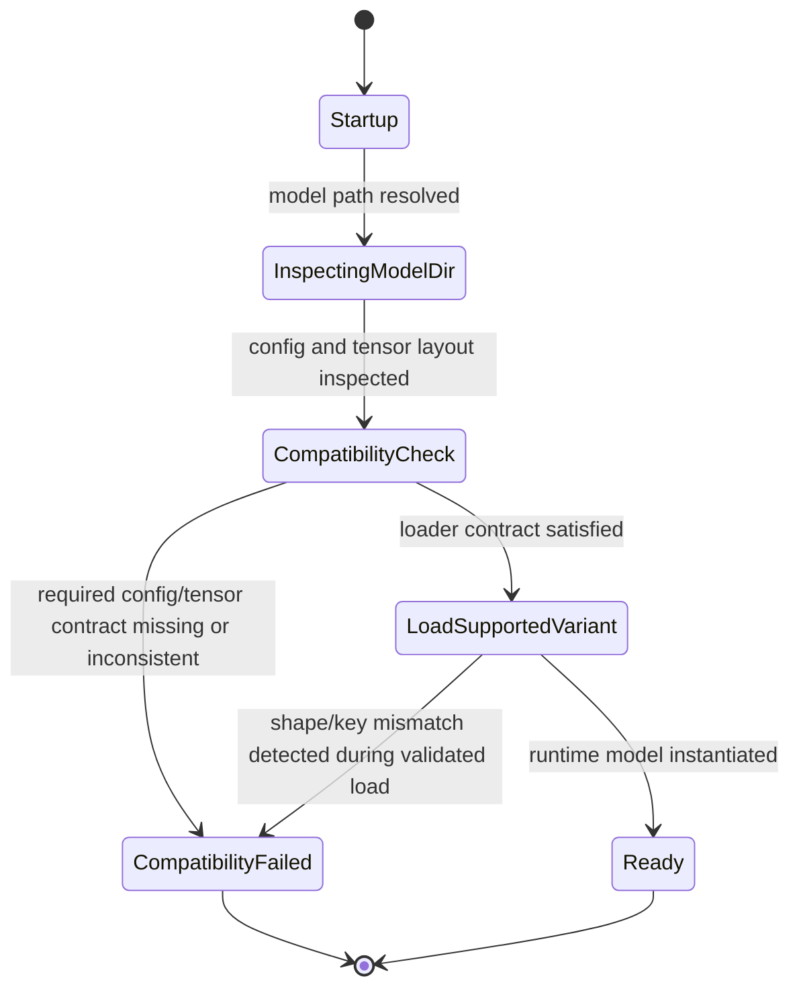

# Architect Output

## Primary spec decision
- create
- path: `docs/spec/features/gemma4-variant-compatible-loading.md`
- rationale: no existing Crane-side spec covers Gemma4 loader compatibility behavior; T-0001 and T-0002 both already point at one shared primary spec path, so creating one feature node avoids duplicate semantics.

## 1) Architectural diagnosis

### Likely bug surface
- Highest-probability failure surface is `crane-core/src/models/gemma4/model.rs::Model::new`.
  - It requires `config.json` to deserialize into `Gemma4ConfigFile { text_config, ... }`.
  - Any Gemma4 variant whose config is flat, differently nested, or omits expected top-level keys will fail before serving.
- Second failure surface is `crane-core/src/models/gemma4/modeling.rs::Gemma4TextModel::new` and `DecoderLayer::new`.
  - The text loader builds weights directly from config-driven dimensions and exact tensor prefixes.
  - Variant differences in layer count, KV-sharing, MoE enablement, per-layer inputs, or weight naming/prefix layout can cause shape/key mismatches during `vb.get(...)` / `linear(...)` construction.
- Lower-probability failure surface is multimodal submodule loading in `model.rs`.
  - Many vision/audio tensors are already optional via `.ok()`, so these paths are less likely to be the first hard crash.
- `crane-oai/src/engine/model_factory.rs` and `adapters/gemma4_adapter.rs` are thin wrappers; they likely need only error propagation / compatibility-preflight integration, not architectural redesign.

### Repo-grounded hypothesis
- The current implementation appears tuned to one Gemma4 checkpoint layout and assumes that any path labeled `gemma4` is load-compatible.
- The requested fix is therefore most likely a compatibility-contract gap, not an inference-runtime gap: Crane needs to distinguish:
  1. supported Gemma4 variants that can map cleanly into the current loader contract;
  2. unsupported structures that must fail early with a diagnostic compatibility error.

### Missing evidence
- Exact target smaller-model PVC path and snapshot directory.
- Actual `config.json` from the failing smaller variant.
- Exact startup stack trace / offending tensor key / expected vs actual shape.
- Whether the smaller variant differs by:
  - flat vs nested config,
  - different text prefix than `model.language_model`,
  - different MoE/per-layer-input flags,
  - different layer count or head dimensions.
- Whether a currently working Gemma4 variant exists in this repo/runtime for regression comparison.

## 2) Primary spec draft

```md
# Gemma4 Variant-Compatible Loading

Links:
- [[spec-index]]
- Tickets: T-0001, T-0002

## Overview

Crane must load supported Gemma4 checkpoint variants from an on-disk model directory without assuming one deployment-specific checkpoint layout. When a Gemma4 directory is structurally incompatible with Crane's implemented loader contract, Crane must fail before serving traffic and emit a diagnostic compatibility error that identifies the incompatible surface.

## Scope / Non-goals

- In scope:
  - Gemma4 startup-time compatibility detection and load gating
  - supported-variant loading from PVC-backed model directories
  - diagnostic failure behavior for unsupported Gemma4 structures
  - preservation of currently working Gemma4 startup behavior
- Non-goals:
  - changing model weights or PVC contents
  - redesigning Crane runtime architecture
  - adding new inference features unrelated to loader compatibility
  - broad multimodal feature expansion

## User-visible behavior

- When Crane is started with `--model-type gemma4` and a supported Gemma4 directory, startup completes and health can become ready.
- When the directory is structurally incompatible, Crane does not enter serving state and reports a compatibility error explaining which contract check failed.
- The loader must make the compatibility decision before traffic is accepted.
- Previously working Gemma4 variants must keep the same successful startup behavior.

## Inputs / Outputs

### Inputs
- model directory path passed via `--model-path`
- Gemma4 config metadata from `config.json`
- Gemma4 safetensors metadata / tensor layout available in the model directory
- explicit or auto-detected model type `gemma4`

### Outputs
- terminal startup result: `ready` or `compatibility_failed`
- on success: instantiated Gemma4 runtime model
- on failure: diagnostic error that names the incompatible surface

## State Model



## Requirements

- `SPEC-GEMMA-001` Crane MUST determine Gemma4 loader compatibility from the checkpoint's on-disk structure and metadata, not from deployment-specific assumptions such as one hardcoded variant path.
- `SPEC-GEMMA-002` If the Gemma4 directory does not satisfy Crane's supported loader contract, Crane MUST fail before serving traffic and MUST NOT report health success.
- `SPEC-GEMMA-003` The compatibility decision MUST validate the minimum loader-critical surfaces required by the implemented Gemma4 text loader: config shape/nesting, required text-model keys/prefixes, and config/weight dimensional consistency needed to instantiate the model.
- `SPEC-GEMMA-004` Compatibility failure output MUST be diagnostic: it MUST identify the incompatible surface category and SHOULD include the first concrete mismatch available (for example missing section, missing tensor prefix/key, or expected-vs-actual dimension mismatch).
- `SPEC-GEMMA-005` The change MUST preserve startup success for Gemma4 variants that already load successfully under the current Crane implementation.

## Edge cases

- If `config.json` exists but uses a different nesting shape than the current loader expects, startup must end in `compatibility_failed`, not a late opaque panic.
- If config implies optional submodules that are absent in weights, the loader must only reject when the missing tensors are required for the selected supported contract.
- If a model directory is identified as Gemma4 by path or config but required text tensors are missing, the loader must reject it as unsupported rather than attempting partial service startup.
- If compatibility cannot be determined because required files are unreadable or absent, that is a startup failure and must not be treated as healthy.
- If a shape mismatch is discovered only during model materialization, the error still counts as compatibility failure provided it occurs before health success and reports the failing surface.

## Errors & failure modes

- missing or unreadable `config.json`
- config cannot be parsed into a supported Gemma4 compatibility shape
- required text-model tensor prefix/key set missing
- config-declared dimensions inconsistent with actual tensor shapes
- unsupported Gemma4 variant structure not yet implemented by Crane
- regression where previously working Gemma4 variant no longer loads

## Compatibility / migration notes

- This spec defines startup compatibility behavior only; it does not require new model conversion or weight rewriting.
- T-0002 rollout depends on this contract: cluster health checks are only meaningful after the loader can distinguish supported vs unsupported Gemma4 variants.
- The deployment model path may change to the validated smaller variant, but rollout semantics stay the same: no traffic before compatible load success.

## Acceptance Criteria (BDD-ready)

- `AC-1` (`SPEC-GEMMA-001`, `SPEC-GEMMA-003`) Given a Gemma4 model directory whose config and required text tensors satisfy Crane's supported loader contract, when Crane starts with `--model-type gemma4`, then the loader classifies the directory as compatible and completes model instantiation.
- `AC-2` (`SPEC-GEMMA-002`, `SPEC-GEMMA-004`) Given a Gemma4 model directory whose config shape, required keys, or dimensions are incompatible with Crane's supported contract, when Crane starts, then Crane fails before serving traffic and returns a diagnostic compatibility error naming the incompatible surface.
- `AC-3` (`SPEC-GEMMA-005`) Given a Gemma4 variant that already works before this change, when Crane starts after the compatibility fix, then startup success behavior remains unchanged.
- `AC-4` (`SPEC-GEMMA-002`, `SPEC-GEMMA-004`) Given a Gemma4 model path that is missing required metadata or weight files, when startup is attempted, then Crane does not become healthy and emits a bounded startup error rather than an ambiguous late failure.
```

## 3) BDD-ready scenarios

- `SC-1` -> `AC-1`
  - Given a fixture/model directory representing a supported smaller Gemma4 variant
  - When compatibility validation runs during startup
  - Then config shape, text prefix/key presence, and critical dimensions are accepted
  - And model construction proceeds to completion
- `SC-2` -> `AC-2`
  - Given a Gemma4 directory with incompatible config nesting
  - When startup begins
  - Then Crane exits before health success
  - And the error identifies config-shape incompatibility
- `SC-3` -> `AC-2`
  - Given a Gemma4 directory with missing required text tensor prefix/key(s)
  - When startup begins
  - Then Crane exits before serving traffic
  - And the error identifies missing loader-critical tensors
- `SC-4` -> `AC-2`
  - Given a Gemma4 directory whose config dimensions disagree with tensor shapes
  - When model materialization is attempted
  - Then Crane fails in compatibility mode
  - And the error includes the first available expected-vs-actual mismatch
- `SC-5` -> `AC-3`
  - Given a Gemma4 checkpoint variant known to load before the fix
  - When the post-fix loader runs
  - Then startup still succeeds without requiring new CLI flags or rollout changes
- `SC-6` -> `AC-4`
  - Given a Gemma4 model path missing `config.json` or required safetensors files
  - When startup begins
  - Then Crane never reports healthy
  - And a bounded startup error is emitted

## 4) Minimal change strategy

- Smallest likely code surface:
  - `crane-core/src/models/gemma4/model.rs`
  - `crane-core/src/models/gemma4/modeling.rs`
  - optionally `crane-oai/src/engine/adapters/gemma4_adapter.rs` only for clearer error wrapping
  - optionally `crane-oai/src/engine/model_factory.rs` only if preflight hookup belongs there
- Preferred strategy:
  1. add a Gemma4 compatibility/preflight step adjacent to loader construction;
  2. make config-shape handling variant-aware enough for the target supported smaller model;
  3. convert opaque load-time shape/key failures into explicit compatibility failures;
  4. add regression coverage for one supported and 2-3 unsupported structures.
- Smallest useful tests:
  - config parsing / compatibility classification tests
  - missing-key / shape-mismatch diagnostic tests
  - regression test for currently supported Gemma4 layout
- Avoid unless proven necessary:
  - engine scheduler changes
  - HTTP handler changes
  - deployment manifest redesign
  - multimodal feature work

## 5) Short rollout implications for T-0002

- T-0002 should stay blocked on T-0001 until one specific smaller Gemma4 PVC path is validated as `supported` by the new contract.
- Rollout evidence must distinguish:
  - compatibility rejection before serving, versus
  - successful model load followed by normal `/health` readiness.
- The current K8s deployment path still references `gemma-4-26B-A4B-it`; if the target smaller variant differs, T-0002 must update the deployment to the validated path, but no new rollout spec is needed.
- Probe semantics from T-0031 remain valid: `/health` must stay false/unavailable until successful compatible load completes.

## Assumptions / blockers
- Assumption: the bug is in startup compatibility detection/loading, not request-time decoding.
- Assumption: a smaller Gemma4 variant should be supported without changing PVC contents.
- Blocker for precise acceptance evidence: absent failing model metadata and exact stack trace.
- Non-blocking ambiguity: whether compatibility preflight is fully separate from `Model::new` or implemented as structured early validation inside it.

## Recommended secondary spec updates
- none during Stage A; T-0002 rollout notes can be updated later to record the validated smaller model path and image tag.
