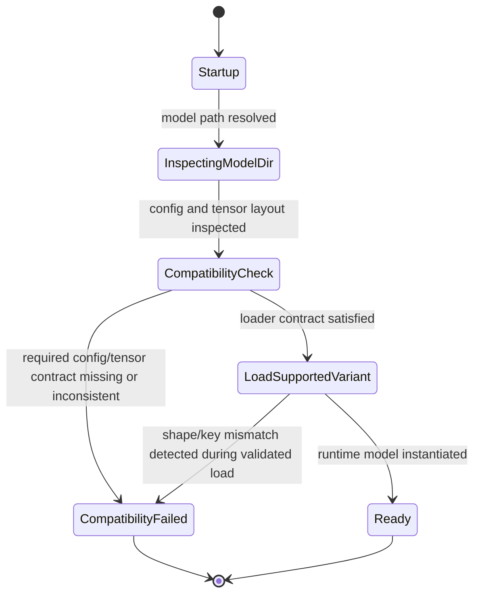

# Gemma4 Variant-Compatible Loading

Links:
- [[spec-index]]
- Tickets: T-0001, T-0002

## Overview

Crane must load supported Gemma4 checkpoint variants from an on-disk model directory without assuming one deployment-specific checkpoint layout. When a Gemma4 directory is structurally incompatible with Crane's implemented loader contract, Crane must fail before serving traffic and emit a diagnostic compatibility error that identifies the incompatible surface.

## Scope / Non-goals

- In scope:
  - Gemma4 startup-time compatibility detection and load gating
  - supported-variant loading from PVC-backed model directories
  - diagnostic failure behavior for unsupported Gemma4 structures
  - preservation of currently working Gemma4 startup behavior
- Non-goals:
  - changing model weights or PVC contents
  - redesigning Crane runtime architecture
  - adding new inference features unrelated to loader compatibility
  - broad multimodal feature expansion

## User-visible behavior

- When Crane is started with `--model-type gemma4` and a supported Gemma4 directory, startup completes and health can become ready.
- When the directory is structurally incompatible, Crane does not enter serving state and reports a compatibility error explaining which contract check failed.
- The loader must make the compatibility decision before traffic is accepted.
- Previously working Gemma4 variants must keep the same successful startup behavior.

## Inputs / Outputs

### Inputs
- model directory path passed via `--model-path`
- Gemma4 config metadata from `config.json`
- Gemma4 safetensors metadata / tensor layout available in the model directory
- explicit or auto-detected model type `gemma4`

### Outputs
- terminal startup result: `ready` or `compatibility_failed`
- on success: instantiated Gemma4 runtime model
- on failure: diagnostic error that names the incompatible surface

## State Model

## Requirements

- `SPEC-GEMMA-001` Crane MUST determine Gemma4 loader compatibility from the checkpoint's on-disk structure and metadata, not from deployment-specific assumptions such as one hardcoded variant path.
- `SPEC-GEMMA-002` If the Gemma4 directory does not satisfy Crane's supported loader contract, Crane MUST fail before serving traffic and MUST NOT report health success.
- `SPEC-GEMMA-003` The compatibility decision MUST validate the minimum loader-critical surfaces required by the implemented Gemma4 text loader: config shape/nesting, required text-model keys/prefixes, and config/weight dimensional consistency needed to instantiate the model.
- `SPEC-GEMMA-004` Compatibility failure output MUST be diagnostic: it MUST identify the incompatible surface category and SHOULD include the first concrete mismatch available (for example missing section, missing tensor prefix/key, or expected-vs-actual dimension mismatch).
- `SPEC-GEMMA-005` The change MUST preserve startup success for Gemma4 variants that already load successfully under the current Crane implementation.

## Edge cases

- If `config.json` exists but uses a different nesting shape than the current loader expects, startup must end in `compatibility_failed`, not a late opaque panic.
- If config implies optional submodules that are absent in weights, the loader must only reject when the missing tensors are required for the selected supported contract.
- If a model directory is identified as Gemma4 by path or config but required text tensors are missing, the loader must reject it as unsupported rather than attempting partial service startup.
- If compatibility cannot be determined because required files are unreadable or absent, that is a startup failure and must not be treated as healthy.
- If a shape mismatch is discovered only during model materialization, the error still counts as compatibility failure provided it occurs before health success and reports the failing surface.

## Errors & failure modes

- missing or unreadable `config.json`
- config cannot be parsed into a supported Gemma4 compatibility shape
- required text-model tensor prefix/key set missing
- config-declared dimensions inconsistent with actual tensor shapes
- unsupported Gemma4 variant structure not yet implemented by Crane
- regression where previously working Gemma4 variant no longer loads

## Compatibility / migration notes

- This spec defines startup compatibility behavior only; it does not require new model conversion or weight rewriting.
- T-0002 rollout depends on this contract: cluster health checks are only meaningful after the loader can distinguish supported vs unsupported Gemma4 variants.
- The deployment model path may change to the validated smaller variant, but rollout semantics stay the same: no traffic before compatible load success.

## Acceptance Criteria (BDD-ready)

- `AC-1` (`SPEC-GEMMA-001`, `SPEC-GEMMA-003`) Given a Gemma4 model directory whose config and required text tensors satisfy Crane's supported loader contract, when Crane starts with `--model-type gemma4`, then the loader classifies the directory as compatible and completes model instantiation.
- `AC-2` (`SPEC-GEMMA-002`, `SPEC-GEMMA-004`) Given a Gemma4 model directory whose config shape, required keys, or dimensions are incompatible with Crane's supported contract, when Crane starts, then Crane fails before serving traffic and returns a diagnostic compatibility error naming the incompatible surface.
- `AC-3` (`SPEC-GEMMA-005`) Given a Gemma4 variant that already works before this change, when Crane starts after the compatibility fix, then startup success behavior remains unchanged.
- `AC-4` (`SPEC-GEMMA-002`, `SPEC-GEMMA-004`) Given a Gemma4 model path that is missing required metadata or weight files, when startup is attempted, then Crane does not become healthy and emits a bounded startup error rather than an ambiguous late failure.
